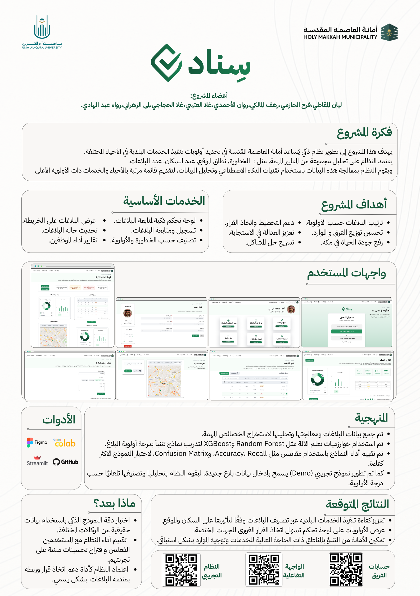

  

<h1 align="center">سِناد (Sanad)</h1>
<h3 align="center">Smart Municipal Service Prioritization System</h3>

  <a href="https://smartserviceprioritymodelproject-hrswvrtl9zknku6cypeivl.streamlit.app/">Live Demo</a> ·
  <a href="https://www.figma.com/design/Uu9l8FvwulS8VDVmnpQQv4/project">Figma Design</a> ·
  <a href="https://drive.google.com/drive/u/1/folders/1AYNrvaGjTG90L4NRtrrrKeqyhielKwhX">Prototype Folder</a>

---

## 💡 Project Idea

Sanad is an intelligent system built to help the **Holy Makkah Municipality (Amanah)** determine the priority of municipal service execution across different neighborhoods. The system analyzes key criteria — risk level, location scope, population, and number of reports — and uses AI and data analysis techniques to process this data and produce a ranked list of neighborhoods and services with the highest priority.

## 🎯 Project Goals

- Rank reports by priority
- Support planning and decision-making
- Improve resource distribution across teams
- Promote fairness in response
- Accelerate problem resolution
- Raise the quality of life in Makkah

## ✨ Core Services

- Smart control dashboard for tracking reports
- Report registration and tracking
- Risk and priority classification
- Map view of reports with live location display
- Report status updates
- Staff performance reports

## 🧪 Methodology

1. Collected and processed report data to extract key features
2. Trained machine learning models (**Random Forest**, **XGBoost**) to predict report priority scores
3. Evaluated model performance using Accuracy, Recall, and Confusion Matrix to select the best-performing model
4. Built a working demo that lets users input new report data, which the system automatically analyzes and classifies by priority level

## 📈 Expected Outcomes

- More efficient execution of municipal services based on impact on population and location
- A priority dashboard that speeds up decision-making for the relevant departments
- Enables the Amanah to anticipate high-need areas and direct resources proactively

## 🛠️ Tools Used

Figma · Google Colab · Streamlit · GitHub

## 🔗 Model

The prediction model was developed by [Ghala Sami](https://github.com/GhalaSami) — see [SmartServicePriorityModelproject](https://github.com/GhalaSami/SmartServicePriorityModelproject) for the model code.

## 👥 Team

- Layan Almqati
- Farah Alhazmi
- Rahaf Almalki
- Rawan Alahmadi
- Ghala Alotaibi
- Ghala Alhajjaji
- Lama Alzahrani
- Rawaa Abdulhadi

---

<i>An AI System Design course project — Umm Al-Qura University, in collaboration with Holy Makkah Municipality</i>

